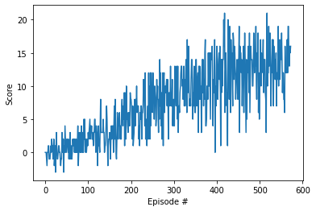

# Navigation Project

This project demonstrates the use of value-based reinforcement learning methods to help navigate an agent in a virtual environment. Deep Q learning was used as the base algorithm and was improved using the Double-Q Network algortihm so as to stabilize the learning process. The environment was provided by Unity, wherein the agent has to navigate a virtual space and receives a reward of +1 for collecting a yellow banana and a reward of -1 for a blue banana. The agent has available with it 4 actions, to move forwards, rightwards, leftwards and backwards.

 

## Learning Algorithm
The learning algorithm used was a Double Deep Q Network, it is an advancement of the Deep Q learning algorithm.

### Q-Learning
It uses a basic learning strategy which involves selecting an action which would eventually yield the highest cumulative reward. These types of algorithms are hence called greedy algorithms 

Then we draw a table of all the Q-Values and update it using the Bellman Equation

### Deep Q Networks
We combine Q Learning and Deep Learning, which yields Deep Q Networks. Q Learning’s table is replaced with a neural network that tries to approximate Q Values. It is usually referred to as the approximator or the approximating function, and denoted as Q(s,a; θ), where θ represents the trainable weights of the network.

### Double Deep Network
However, taking the maximum overestimated values as such is implicitly taking the estimate of the maximum value. This systematic overestimation introduces a maximization bias in learning. And since Q-learning involves bootstrapping — learning estimates from estimates — such overestimation can be problematic.

The solution involves using two separate Q-value estimators, each of which is used to update the other. Using these independent estimators, we can unbiased Q-value estimates of the actions selected using the opposite estimator. We can thus avoid maximization bias by disentangling our updates from biased estimates.

In the Double Q-learning algorithm, we have a model Q and a target model Q’. We use the Q’ for action selection and Q for action evaluation

We minimize the mean squared error between Q and Q* , but we have Q' slowly copy the parameters of Q

where θ’ is the target network parameter, θ is the primary network parameter, and τ (rate of averaging) is usually set to 0.01

  ### Hyperparameters

  | Hyperparameter                      | Value |
  | ----------------------------------- | ----- |
  | Replay buffer size                  | 1e5   |
  | Batch size                          | 64    |
  | $\gamma$ (discount factor)          | 0.99  |
  | $\tau$                              | 1e-3  |
  | Learning rate                       | 5e-4  |
  | update interval                     | 4     |
  | Number of episodes                  | 500   |
  | Max number of timesteps per episode | 2000  |
  | Epsilon start                       | 1.0   |
  | Epsilon minimum                     | 0.1   |
  | Epsilon decay                       | 0.995 |

  # Plot of Rewards

  The trained agent can be seen in action below:

   

  The performance achieved by **Double DQN** where the reward of +13 was achieved in **473** episodes is plotted as follows: 

   

## Ideas for Future Work

- Using RAINBOW ([paper](https://arxiv.org/abs/1710.02298)). This paper examines six extensions to the DQN algorithm and empirically studies their combination. Our experiments show that the combination provides state-of-the-art performance on the Atari 2600 benchmark, both in terms of data efficiency and final performance. It also provides results from a detailed ablation study that shows the contribution of each component to overall performance.

- Further Hyperparamter tweaking can also lead to much better performance and/or efficiency.

Author: [Vihaan Misra](http://github.com/convexalpha) 
